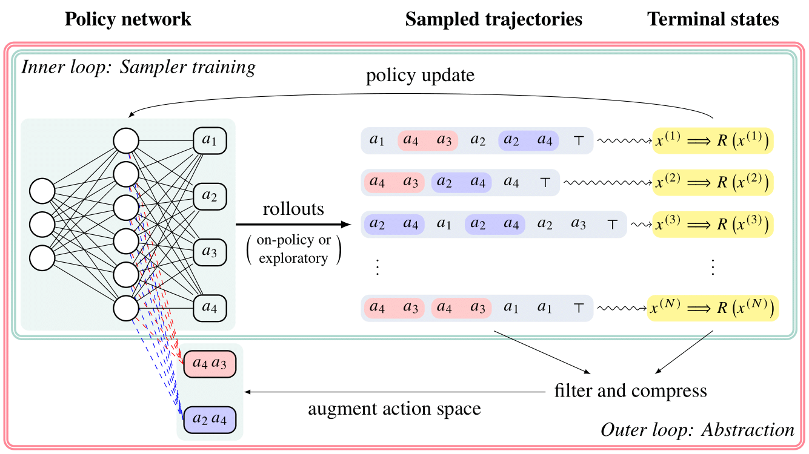

<div align="center">
  
# Action abstractions for amortized sampling


[](https://github.com/pre-commit/pre-commit)
[](https://pytorch.org/get-started/locally/)
[](https://pytorchlightning.ai/)
[](https://hydra.cc/) 

 
</div>

## Description

This is the official repository to the paper ["Action abstractions for amortized sampling"](https://arxiv.org/abs/2410.15184) by Oussama Boussif, Léna Néhale Ezzine, Joseph D Viviano, Michał Koziarski, Moksh Jain, Nikolay Malkin, Emmanuel Bengio, Rim Assouel and Yoshua Bengio.

We introduce **ActionPiece**, a method for discovering action abstractions in reinforcement learning (RL) and generative flow networks (GFlowNets) to improve exploration and credit assignment in long-horizon tasks. By iteratively identifying and chunking frequently used action subsequences, our approach enhances sample efficiency and mode discovery, particularly in entropy-seeking RL. Empirical results show improved performance in discovering diverse high-reward states, with learned abstractions capturing the latent structure of the action space.



## Citation
If you use this codebase, or otherwise found our work valuable, please cite ActionPiece

```
@inproceedings{Boussif2024action,
  title  = {Action abstractions for amortized sampling},
  author = {Oussama Boussif and Lena Nehale Ezzine and Joseph D Viviano and Michał Koziarski and Moksh Jain and Nikolay Malkin and Emmanuel Bengio and Rim Assouel and Yoshua Bengio},
  year   = {2024},
  url    = {https://openreview.net/forum?id=ispjankYab&referrer=%5Bthe%20profile%20of%20Oussama%20Boussif%5D(%2Fprofile%3Fid%3D~Oussama_Boussif1)}
}
```

## Installation

This project requires `python>=3.10`. To install, we recommend first setting up a virtual environment of your choice, and then pip installing this package:

`pip install -e .`

### Experiments

Experiment runs can be found in `sbatch_scripts/`. Runs are run via `main.py` and all
options are handled by `hydra`. See below for an example.

```bash
python main.py seed=42 environment=bit_sequence algo=tb_gfn trainer.max_epochs=1000 environment.max_len=128 algo.replay_buffer.cutoff_distance=25 algo.reward_temperature=0.3333 logger.wandb.name="prioritized-len-128"
```

### Datasets

To make some datasets available, make sure to add this to your environment.

```bash
#!/bin/bash
export CHUNKGFN_DATA="/path/to/code/chunk-gfn/data"
```

to download those datasets, look in
`/path/to/code/chunk-gfn/data/${dataset}/download.sh`.

### Logs

The logging directory is determined in `configs/paths/default.yaml` it is by default
`log_dir: ${oc.env:PROJECT_DIR}/logs/` and could be changed if to any location in
your environment if desired.

When using `SLURM`, the system will automatically define the following environment variables and our code expects them to be defined. When not using slurm, `SLURM_JOB_ID` and `SLURM_JOB_NAME` will be automatically generated. This will determine the log directory.
